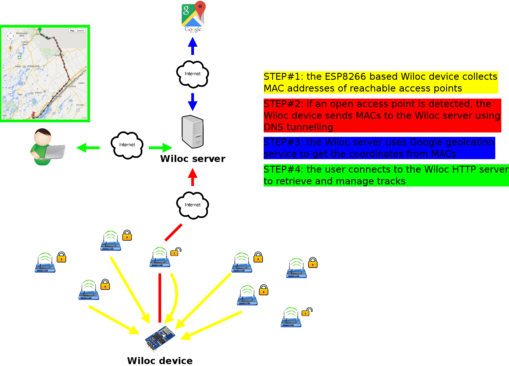

# WiFi based geotracking


## Description

WiLoc (short for WIfi LOCator) is primarly a WiFi based tracking
device that reports to a web server.

In the simplest configuration, a wiloc device relies only on
WiFi to implement both tracking and Internet communication. That
is, no additional modules are needed (GPS, GSM ...). It does so
by using:
- DNS tunnelling to communicate information (MAC addresses ...)
to the web server through open access points,
- geolocation services to resolve MAC addresses into coordinates.

The following diagram describes how it works:


So, it is mainly useful in urban environments where WiFi access
points are available, and for which a decent MAC to coordinate
mapping exists (ie. most cities ...).

Also, the protocol supports for a GPS auxiliary device when
available. This can be used for contributing logs to help WiFi
based gelocation services to maintain their databases.


## Installation

### Configure a DNS zone
First, you have to configure your DNS zone so that A queries
are redirected to your server.

### Compile and run the server
First, compile the server binary:
```
cd $(WILOC_REPO)/src/server
make
```
It produces a binary. Run it (may require root priviledges)
using the following command line options:
- -dns_laddr: DNS server local address (default: 0.0.0.0)
- -dns_lport: DNS server local port (default: 53)
- -http_laddr: HTTP server local address (default: 0.0.0.0)
- -http_lport: HTTP server local port (default: 80)
- -geoloc_key: Google geolocation API key

### Compile and upload the device firmware
First, you have to install the esp-open-sdk from
https://github.com/pfalcon/esp-open-sdk.

Then, compile and upload the firmware in the ESP8266 flash memory:
```
cd $(WILOC_REPO)/src/device
ESP_SDK_DIR=<sdk_path> CONFIG_DNS_ZONE=".my.zone.com" make -f esp8266.mk flash
```
